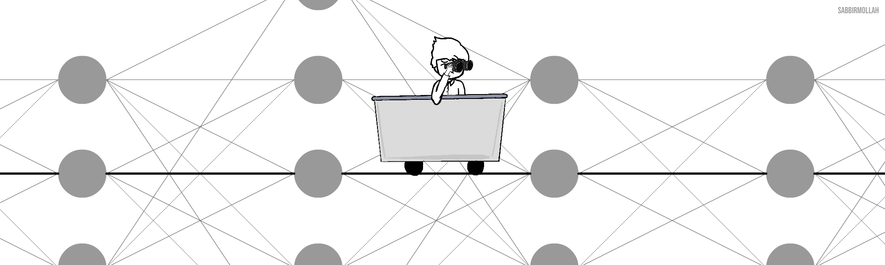

# Hello World 💻

I am currently delving deep into *Neural Networks* 🚂   

* 🤔   Interested in *Artificial Intelligence*.

* 🌱   Continuously learning  *Mathematics* & *Philosophy*.

* 🎓   Pursuing Bachelors Degree in CSE at [North South University](http://www.northsouth.edu/).

* 💼 Leading as *Chair* at [NSU ACM Student Chapter](https://medium.com/@sabbirmollah).

* 📖   Currently reading these awesome [books](https://www.goodreads.com/review/list/82590914?shelf=currently-reading).

* 📝 Turns thoughts into words [here](https://medium.com/@sabbirmollah).

### Favorite Programming Languages and Tools 🔭🚀🔥
 |  | |
|:---:|:---:|:---:|

<i>Follow me around the web:</i> 

  <a target="_blank" href="https://www.linkedin.com/in/sabbir-mollah/">LinkedIn</a> ●
  <a target="_blank" href="https://www.facebook.com/sabbir.sabby/">Facebook</a> ●
  <a target="_blank" href="https://medium.com/@sabbirmollah/">Medium</a> ●
  <a target="_blank" href="https://www.goodreads.com/user/show/82590914-sabbir">GoodReads</a>

  
My Github Stats

   

